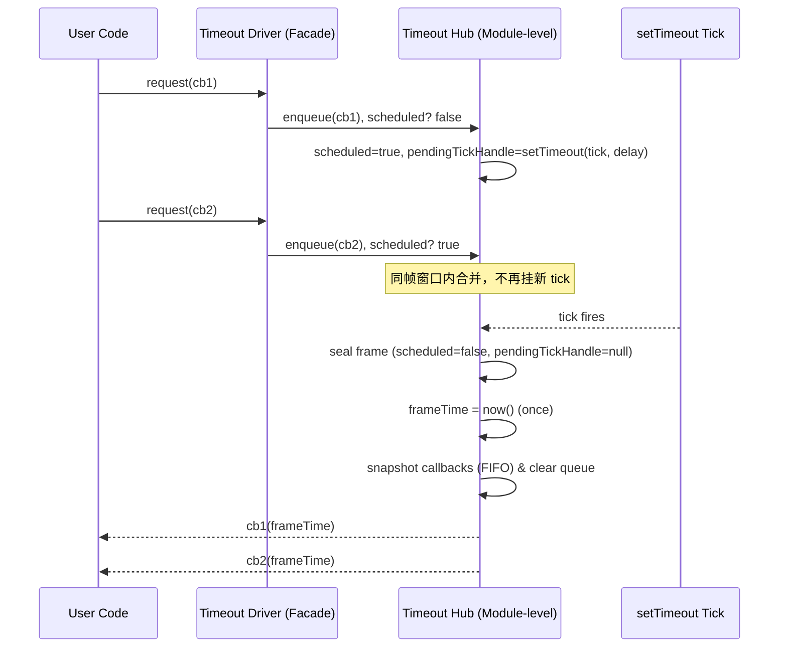
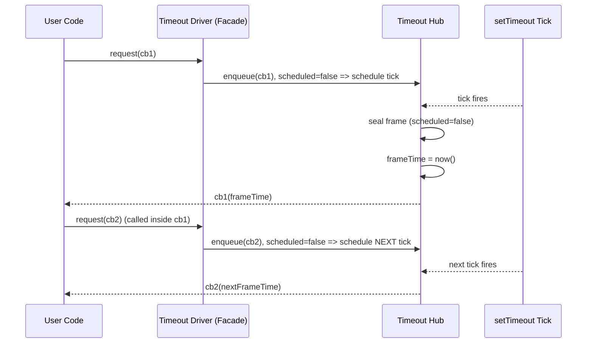

# createTimeoutDriver.md

> 目标：在缺失 requestAnimationFrame 的运行环境中，用 setTimeout 模拟 RAF，并且 **强对齐 RAF 的关键语义**（同帧合并 + 同帧共享 timestamp + flush 期间新注册进入下一帧 + requestId/cancel 语义尽量一致）。

---

## 0. API

### 0.1 Type Definitions

```ts
export type TimeoutHandle = number | ReturnType<typeof globalThis.setTimeout>;

/**
 * timeout driver 对外暴露的 requestId：
 * - 强对齐 RAF：对外统一返回 number（而不是直接透传 TimeoutHandle）
 * - 底层 TimeoutHandle 仅用于 hub 内部记录 pending tick
 */
export type FrameRequestId = number;

export type FrameCallback = (frameTime: number) => void;

export interface FrameDriver {
  /**
   * 请求“下一帧”执行一次回调。
   * - timeout driver：同帧合并（coalescing），同帧共享 frameTime，flush 期间新注册进入下一帧
   */
  request(cb: FrameCallback): FrameRequestId;

  /**
   * 取消一次已 request 但尚未执行的回调。
   * - 若本帧所有回调均被取消，则应取消底层 pending tick
   */
  cancel(id: FrameRequestId): void;

  /**
   * 获取当前时间戳（用于 meta.at / 逻辑时间线；不一定等于 frameTime）
   * - timeout driver：frameTime 取自 now()，但需保证同帧共享同一个 frameTime（tick 开始时取一次）
   */
  now(): number;

  /**
   * 标识（调试用，可选）
   * - timeout driver：通常为 "timeout"
   */
  readonly type?: string;
}

/**
 * CreateTimeoutDriverOptions
 * 说明：timeout driver 属于 base driver（平台适配 + 行为对齐），因此 options 仅覆盖“底座能力与对齐语义”。
 */
export interface CreateTimeoutDriverOptions {
  /**
   * 指定 setTimeout / clearTimeout（便于测试环境注入）
   * - 默认从 globalThis 取
   */
  setTimeout?: (cb: () => void, ms: number) => TimeoutHandle;
  clearTimeout?: (id: TimeoutHandle) => void;

  /**
   * now() 的实现
   * - 默认：performance.now()（若存在）否则 Date.now()
   */
  now?: () => number;

  /**
   * 模拟帧的延迟（默认 16）
   * 注意：语义重点是“同帧合并”，不是 fps 保证
   */
  delay?: number;

  /**
   * 可选：调试标识
   * - 默认 "timeout"
   */
  type?: string;
}
```

### 0.2 Function Signature

```ts
/**
 * createTimeoutDriver
 * - 强对齐 RAF：同帧合并 + 同帧共享 frameTime + flush 期间新注册进入下一帧 + FIFO + requestId/cancel 语义对齐
 * - 跨实例：通过模块级 Hub 实现同帧合并（同一底座实现共享同一 Hub）
 */
export function createTimeoutDriver(options?: CreateTimeoutDriverOptions): FrameDriver;
```

### 0.3 Params

- options.setTimeout

  - 类型：(cb: () => void, ms: number) => TimeoutHandle
  - 默认：globalThis.setTimeout（若存在）
  - 用途：驱动 pending tick

- options.clearTimeout

  - 类型：(id: TimeoutHandle) => void
  - 默认：globalThis.clearTimeout（若存在）
  - 用途：取消 pending tick

- options.now

  - 类型：() => number
  - 默认：performance.now()（若存在）否则 Date.now()
  - 用途：为每个 tick 生成同帧共享 frameTime

- options.delay

  - 类型：number
  - 默认：16
  - 用途：模拟“下一帧”；语义关键是“同帧合并窗口”，不是 60fps 保证

- options.type
  - 类型：string
  - 默认："timeout"
  - 用途：调试标识

### 0.4 Result

createTimeoutDriver 返回一个 FrameDriver 实例，包含：

- request(cb): FrameRequestId
- cancel(id): void
- now(): number
- type?: string

---

## 1. 设计目标（Strong RAF Semantic Parity）

createTimeoutDriver 不是“每次 request 就 setTimeout 一次”的简单替代，而是要尽量对齐 RAF 的这些语义：

1. **同一帧合并（Coalescing）**

- 在同一个“帧窗口”内发起的多次 request，应进入同一个队列，并且只触发一次底层 tick。
- RAF 在平台层面天然跨调用点合并；timeout fallback 需要在库层面实现合并。

2. **同一帧共享 timestamp（Shared frameTime）**

- RAF 回调在同一帧内共享同一个 frameTime。
- timeout fallback 需要在 tick flush 开始时只取一次 now()，并把同一个 frameTime 传给本帧所有回调。

3. **flush 期间注册的 request 进入下一帧（Next-frame scheduling）**

- RAF 回调执行期间调用 requestAnimationFrame，会进入下一帧。
- timeout fallback 需要在 tick 开始时“封口当前帧”，确保 flush 过程中新增 request 不会混入当前帧。

4. **回调执行顺序（FIFO）**

- 约定同帧回调以 FIFO 执行（按注册顺序执行），提升确定性与可测试性。

5. **requestId / cancel 语义对齐**

- 每一次 request 返回一个独立 requestId。
- 在回调执行前调用 cancel(requestId) 能撤销对应回调。
- 回调执行后，该 requestId 自动失效（再次 cancel 应为 no-op）。

---

## 2. 作用域与跨实例共享（Module-level Hub）

### 2.1 为什么必须跨实例共享

- RAF 是平台全局队列：raf(cb1) 与 raf(cb2)（来自不同调用点/不同封装实例）通常会在同一帧 flush 中执行。
- timeout fallback 要强对齐 RAF，必须让不同 createTimeoutDriver 实例共享同一个“帧窗口队列”，否则会退化为“实例内合并”，行为与 RAF 不一致。

### 2.2 “按底座实现分域”的共享策略

为了避免把不同的“时钟域/调度域”硬合并（例如测试注入不同 setTimeout/now），Hub 的共享范围定义为：

- **同一套底层调度实现（setTimeout / clearTimeout / now / delay）共享一个 Hub**
- 不同底座实现分到不同 Hub，避免混域引起不可预期行为

### 2.3 Hub 的 Key（如何跨实例命中同一 Hub）

不能用 options 对象引用当 key（每次创建都是新对象）。采用“函数 identity 分配内部 id + 复合 key”：

- 为每个函数引用（setTimeoutFn / clearTimeoutFn / nowFn）分配递增 fnId
- hubKey = fnId(setTimeoutFn) + "|" + fnId(clearTimeoutFn) + "|" + fnId(nowFn) + "|" + delay

当不同 createTimeoutDriver 实例传入的是同一函数引用（默认 globalThis 或同一个 mock），就会命中同一个 Hub，从而共享同帧合并状态。

> 说明：模块级共享只能保证“同一份库代码 / 同一 bundle”内共享。跨 bundle（页面打进两份不同版本库）无法共享；如需跨 bundle，可未来升级为挂载到 globalThis + Symbol.for，但暂不实现。

---

## 3. “同一帧”的定义（Batch = Pending Tick）

timeout fallback 无法识别真实渲染帧，因此采用与 RAF 行为等价的定义：

- **同一帧 = 同一个尚未执行的 pending tick（同一个 batch）**
- batch 的 key 不是时间戳区间，而是“是否属于同一个已挂起但未执行的 tick”

对应 RAF 语义：

- 在 RAF flush 开始之前注册的回调 -> 同一 flush（同一帧）
- flush 执行期间注册的新回调 -> 下一帧

---

## 4. Hub 内部状态与数据结构

Hub 需要维护以下共享状态（跨实例）：

- scheduled: boolean

  - 是否已挂起一个 tick（同帧窗口是否已开启）
  - 这就是“同帧 key”的核心

- pendingTickHandle: TimeoutHandle | null

  - 底层 setTimeout 的句柄
  - 同一帧窗口只允许存在一个 pendingTickHandle

- batchSeq: number（可选，调试/诊断用）

  - 每开启一个新帧窗口，batchSeq + 1

- nextRequestId: number

  - requestId 自增序列（返回给调用方）

- queue: Map<number, FrameCallback>

  - 存储当前帧窗口内所有回调
  - 使用 Map 以支持按 requestId 精确 cancel
  - FIFO 顺序通过“记录插入顺序”的方式保证（Map 迭代顺序为插入顺序）

- now(): number

  - 由底座注入或默认实现（performance.now 优先，否则 Date.now）

- delay: number
  - 模拟帧延迟（默认 16），但语义重点是“同帧合并”，不是 fps 保证

---

## 5. 算法流程（关键语义实现）

### 5.1 request(cb) 的逻辑

输入：FrameCallback  
输出：requestId（number）

流程：

1. requestId = ++nextRequestId
2. queue.set(requestId, cb)（保持 FIFO）
3. 如果 scheduled 为 false：
   - scheduled = true
   - batchSeq += 1（可选）
   - pendingTickHandle = setTimeout(tick, delay)
4. return requestId

语义：

- 同一帧窗口内多次 request 只会挂一次底层 tick
- 不同实例调用 request，最终都落到同一个 queue（跨实例同帧合并）

### 5.2 cancel(requestId) 的逻辑

输入：requestId  
输出：void

流程：

1. queue.delete(requestId)
2. 若 queue.size === 0 且 scheduled === true 且 pendingTickHandle != null：
   - clearTimeout(pendingTickHandle)
   - pendingTickHandle = null
   - scheduled = false
   - （可选）本帧窗口被取消，相当于没有任务需要 flush

语义：

- 精确取消单个回调
- 若本帧所有回调都被取消，则底层 tick 也取消（节省一次空 flush）

### 5.3 tick() 的逻辑（flush）

tick 触发时，必须实现两件事：同帧共享 timestamp + flush 期间新增 request 进下一帧。

推荐流程（注意顺序）：

1. 立即“封口当前帧窗口”

   - scheduled = false
   - pendingTickHandle = null
   - （目的：flush 过程中新增 request 会看到 scheduled=false，从而开启下一帧）

2. 取同帧 timestamp

   - frameTime = now()（只取一次）

3. 快照当前队列并清空

   - callbacks = Array.from(queue.values())（FIFO）
   - queue.clear()

4. 批量执行
   - for each cb in callbacks: cb(frameTime)

语义：

- 同一帧所有回调共享同一个 frameTime
- flush 过程中调用 request：
  - 因为 scheduled 已被置回 false
  - 新 request 将开启下一帧窗口并挂起下一次 tick
  - 不会混入当前 callbacks（严格对齐 RAF）

---

## 6. requestId 语义（对齐 RAF）

1. 唯一性：每次 request 分配新 requestId（单调递增）
2. 可取消：cancel(requestId) 在执行前撤销该回调
3. 执行后失效：回调被 flush 后不再存在于 queue，cancel 变为 no-op
4. 类型对齐：

- RAF 的 requestId 是 number
- timeout fallback 也返回 number
- 底层 TimeoutHandle 不暴露给调用方，只存在于 Hub 内部（pendingTickHandle）

---

## 7. FIFO 顺序保证策略

- 采用 queue: Map<number, FrameCallback>
- 插入顺序即执行顺序：
  - tick 时用 Array.from(queue.values()) 获取回调列表
  - Map 迭代顺序为插入顺序，可作为 FIFO 基础
- 注意：
  - 若某 requestId 被 delete 后再 set，会改变顺序（符合“重新注册”的语义）

---

## 8. 注入与默认实现

createTimeoutDriver 支持注入（用于测试/跨端）：

- setTimeout / clearTimeout
- now
- delay

默认实现（不展开代码，仅定义语义）：

- setTimeout/clearTimeout：优先 globalThis 上的实现
- now：优先 performance.now，否则 Date.now
- delay：默认 16

共享域（Hub）由“注入底座”决定：相同底座实现命中同一 Hub，否则分 Hub。

---

## 9. 与增强型 shared driver 的关系（分层边界）

- createTimeoutDriver 属于 base driver（平台适配 + 行为对齐）
  - 重点：同帧合并、同帧 timestamp、flush/next-frame 语义、requestId/cancel 语义、FIFO
- enhanced shared driver（后续）属于功能增强
  - 例如：单 tick hub 合并（跨 RAF/timeout 的统一 hub）、批量 flush、budget/time-slicing、优先级等
- 当前 createTimeoutDriver 的 Hub 只用于对齐 RAF 的关键语义，不引入 budget/time-slicing。

---

## 10. 可测试性要点（只记录技术点）

- fake timers 下验证：
  - 同一 delay 窗口内多次 request 只触发一次底层 tick
  - 同一 tick 内多个回调共享同一个 frameTime（可 mock now() 返回值，或断言同值）
  - flush 中 request 必进入下一帧（通过在回调内部再 request，并推进 timers 两次验证）
  - cancel 单个 requestId 生效
  - cancel 到 queue 为空时会 clear 掉底层 pending tick

---

## 11. 时序图（Sequence Diagram）

### 11.1 同帧合并：多次 request 只挂一个 tick，并在同一帧 flush



### 11.2 flush 期间新增 request：进入下一帧



---

## 12. 流程图（Flowchart）

request 整体简化流程

```md
开始

↓

1. request(cb1) - 第一次请求，调用 setTimeout 设置 tick。
   ↓
   设置计时器，延迟后触发 tick。
   cb1 被加入到 cbQueue。

   ↓

2. 新请求(cb2, cb3, ...) - 更多回调加入 cbQueue。
   ↓
   所有回调都加入同一个 cbQueue。

   ↓

3. 计时器延迟完成 - 到达 tick 执行时间。
   ↓
   执行 tick：
   a) 设置 hasPendingTick = false
   b) 清除 pendingTickHandle
   c) 快照 cbQueue（冻结当前 cbQueue 状态）
   d) 清空 cbQueue（为下一轮做准备）

   ↓

4. 执行快照中的回调（按 FIFO 顺序）
   ↓
   执行 cb1, cb2, cb3... 从快照中取出并执行。
   ↓
5. tick 执行过程中有新请求 - 新回调到来。
   ↓
   新回调加入新的 cbQueue。
   ↓
   设置下一个 tick 的 setTimeout（下一帧执行）。
   ↓
   回到步骤 3，开始下一个 tick。

结束
```

### 12.1 request 流程

```mermaid
flowchart TD
  A[request(cb)] --> B[allocate requestId]
  B --> C[queue.set(requestId, cb)]
  C --> D{scheduled?}
  D -- no --> E[scheduled=true]
  E --> F[pendingTickHandle = setTimeout(tick, delay)]
  D -- yes --> G[do nothing (coalesced)]
  F --> H[return requestId]
  G --> H[return requestId]
```

### 12.2 tick(flush) 流程

```mermaid
flowchart TD
  A[tick fires] --> B[seal frame: scheduled=false, pendingTickHandle=null]
  B --> C[frameTime = now() (once)]
  C --> D[snapshot callbacks FIFO]
  D --> E[queue.clear()]
  E --> F[for each cb: cb(frameTime)]
  F --> G[done]
```

### 12.3 cancel 流程

```mermaid
flowchart TD
  A[cancel(requestId)] --> B[queue.delete(requestId)]
  B --> C{queue.size == 0 AND scheduled == true AND pendingTickHandle != null}
  C -- yes --> D[clearTimeout(pendingTickHandle)]
  D --> E[pendingTickHandle=null; scheduled=false]
  C -- no --> F[no-op]
  E --> G[done]
  F --> G[done]
```

---

## 13. TODO（仅记录，不实现）

- 如需跨 bundle 共享 Hub：把 Hub 挂载到 globalThis + Symbol.for（后续增强再做）
- 与 createFrameDriver / createSharedFrameDriver 的组装关系在 drivers 层完成（此文仅描述 createTimeoutDriver 本身）

---

## FAQ

### 1）问题：如果我在当前帧的第 13ms 请求一个回调，如何确保回调不会在下一帧的中途执行？是否可以保证每一帧都执行一次回调，不论请求发生在当前帧的哪个时间点？

尽管回调请求可能在当前帧的任何时刻触发（比如在第 13ms），但由于「事件循环机制」，回调会被推迟到下一个帧的开始，通常会在 16ms 时执行。这是因为：

1. **请求触发时间与执行时间的关系：**

   - 如果你在当前帧的第 13ms 请求了一个回调，`setTimeout` 会按照指定的延迟执行回调，通常会在 16ms 或更晚的时间点执行。这确保了回调会在“下一帧”执行，而不会在当前帧的中途执行。

2. **事件循环与渲染：**

   - JavaScript 的事件循环在每一帧结束时才会触发渲染。任何请求的回调都会被排到下一轮的事件循环中执行，从而避免在同一帧内发生不连续的执行。

3. **时间对齐：**
   - 无论请求发生在当前帧的开始、中间或结束，`setTimeout` 都会确保回调按帧对齐，即使请求在 13ms 触发，回调仍然会被延迟到下一帧的 16ms 时执行，从而保持每帧仅执行一次回调。

总结来说，即使回调请求发生在当前帧的中间，只要时间窗口卡在 16ms 的范围内，回调就会在下一个合适的时间点执行，确保每一帧都能稳定执行一次回调。
