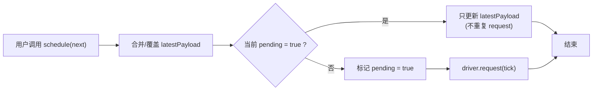
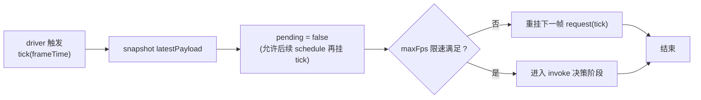
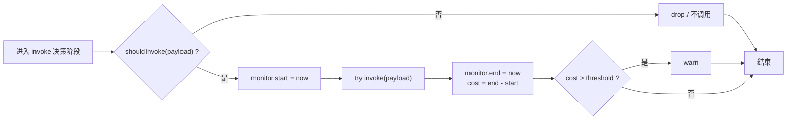
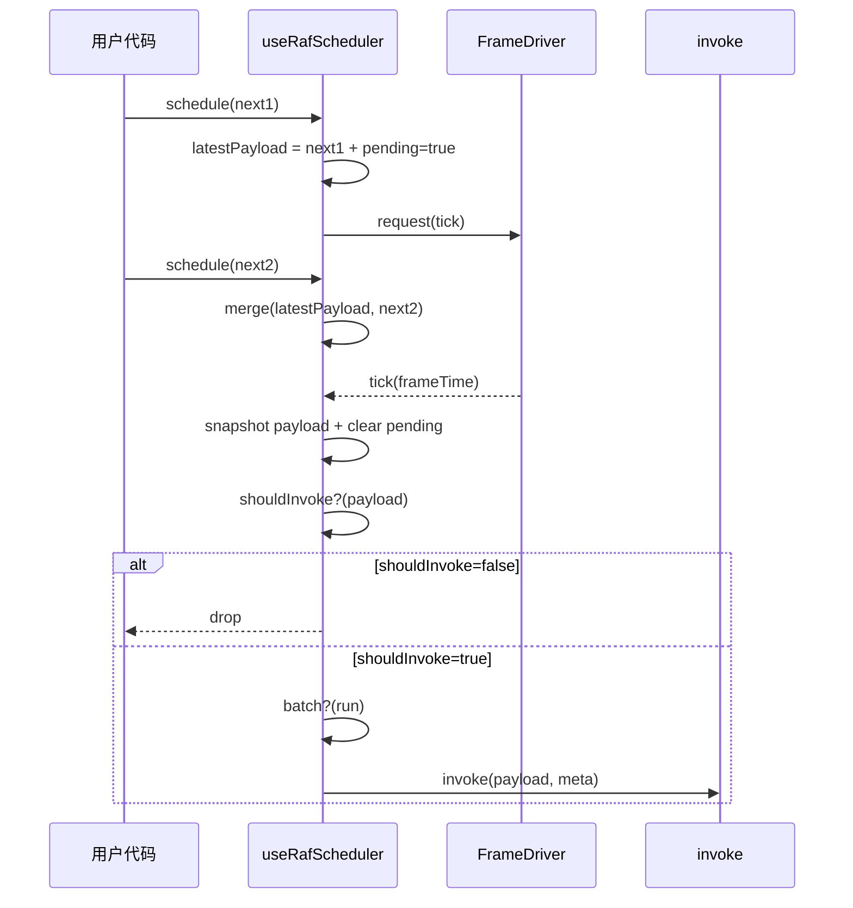

---
nav:
  path: /hooks
---

# useRafScheduler

对齐 “帧边界” 的调度器：**同一帧内多次 schedule 合并为一次执行**，并支持 `flush/cancel`、条件执行、帧率限制与可选的性能监控（cost）。

## 何时使用

- 你需要把频繁更新（输入、滚动、拖拽、订阅数据）**合并到下一帧**执行，减少抖动与重复渲染
- 现有提供出来的简化 Hooks（见 **「useRaf 系列」**的其他 Hooks） 不符合预期，需要更为完整的功能或者自定义封装
- 你需要自定义 `FrameDriver` 或者指定使用具体的 `FrameDriver` 来进行 “帧调度”

`useRafScheduler` 提供更为完整的功能接口和配置项，但是使用起来的上手难度和心智负担也更高。

建议优先使用基于 `useRafScheduler` 封装好的其他 「useRaf 系列」 Hooks，他们语义化更好，使用难度也更低。

---

## 运行机制

### 流程图（单例生效、跨实例暂不支持）

#### 1) schedule 阶段：合并 payload + 只挂一次 tick



#### 2) tick 阶段：拍快照 + 清 pending + 做限速 gate



#### 3) invoke 阶段：shouldInvoke gate + 监控耗时 + warn



---

### 时序图（核心状态机）



---

## 代码演示

#### 由于 “一帧” 肉眼无法捕捉，很难起到演示的作用，因此下面的代码演示均使用 `createTimeoutDriver()` 模拟慢速帧模式下的 “帧调度”、“flush”、“cancel” 的行为。与此同时我们会提供按钮让使用者切换回正常的帧率下感受行为一致性。

<code src="../demo/useRafScheduler/basic.tsx"></code>

<code src="../demo/useRafScheduler/mergeAccumulate.tsx"></code>

<code src="../demo/useRafScheduler/fpsLimit.tsx"></code>

<code src="../demo/useRafScheduler/guards.tsx"></code>

<code src="../demo/useRafScheduler/flushCancel.tsx"></code>

<code src="../demo/useRafScheduler/monitorAndError.tsx"></code>

## API

```typescript
import useRafScheduler from '@tx-labs/react-hooks/useRafScheduler';
import type { FrameDriver } from '@tx-labs/react-hooks/useRafScheduler/core/drivers';

const actions = useRafScheduler<T>(
  (payload, meta) => {
    // 下一帧触发：meta.reason === 'frame'
    // flush 触发：meta.reason === 'flush'
    // 高精度时间戳：meta.at（来自 driver.now()）
    // RAF-like driver 才会有 meta.frameTime
    // 开启监控后才会有 meta.cost
  },
  {
    // 1) driver：可注入；默认内部用 createFrameDriver()
    driver: undefined as unknown as FrameDriver,

    // 2) 同帧合并：默认 takeLatest（(_, next) => next）
    merge: (prev, next) => next,

    // 3) 条件执行：调度前守卫（决定是否更新 pending payload / 是否需要 tick）
    shouldSchedule: (pending, next) => true,

    // 4) 条件执行：执行前二次守卫（tick 真触发时再判断一次）
    shouldInvoke: (payload) => true,

    // 5) cancel 行为：是否先 flush 一次（默认 false）
    flushOnCancel: false,

    // 6) 单实例限速：例如 30fps（最小可行）
    maxFps: 30,

    // 7) 批量更新口子：未来可注入 ReactDOM.unstable_batchedUpdates
    batch: (run) => run(),

    // 8) 错误隔离：invoke 抛错不会破坏 scheduler 状态机
    onError: (error, payload, meta) => {
      // 这里做日志收敛或降级
      console.error(error, payload, meta);
    },

    // 9) 性能监控：测 cost 并告警（默认关闭，建议只在 dev 打开）
    monitor: true,
    warnThresholdMs: 8,
    onWarn: (message, info) => {
      console.warn(message, info);
    },
  },
);

// schedule：同一帧内多次调用会合并
actions.schedule(next);

// cancel：取消下一帧触发并清空 pending
actions.cancel();

// flush：若存在 pending，立刻同步执行一次并清空 pending
actions.flush();

// dispose：语义化 cancel（通常用于 unmount）
actions.dispose();

// pending：适合渲染用（getter）
const p1: boolean = actions.pending;

// isPending：函数式读取（更抗误用，避免闭包陷阱）
const p2: boolean = actions.isPending();

// getLatestPayload：读取当前 pending 的 payload（测试/调试/高级用法）
const payload: T | undefined = actions.getLatestPayload();
```

### Params

| 参数                    | 说明                                        | 类型                             | 默认值                |
| ----------------------- | ------------------------------------------- | -------------------------------- | --------------------- |
| invoke                  | 下一帧（或 flush）真正执行的回调            | `(payload, meta) => void`        | -                     |
| options.driver          | 注入 FrameDriver（request/cancel/now/type） | `FrameDriver`                    | `createFrameDriver()` |
| options.merge           | 同帧 payload 合并策略                       | `(prev, next) => T`              | takeLatest            |
| options.shouldSchedule  | 调度前守卫（跳过/保留 tick）                | `(pending, next) => boolean`     | `() => true`          |
| options.shouldInvoke    | 执行前二次守卫（tick 时判断）               | `(payload) => boolean`           | -                     |
| options.flushOnCancel   | cancel 是否先 flush                         | `boolean`                        | `false`               |
| options.maxFps          | 单实例限速（跳帧）                          | `number`                         | -                     |
| options.batch           | 批量更新包裹                                | `(run) => void`                  | -                     |
| options.onError         | 错误隔离回调                                | `(error, payload, meta) => void` | -                     |
| options.monitor         | 是否测量 cost                               | `boolean`                        | `false`               |
| options.warnThresholdMs | cost 超阈值告警阈值                         | `number`                         | 建议 6~8ms            |
| options.onWarn          | 告警回调                                    | `(message, info) => void`        | -                     |

### Result

返回一个 actions 对象：

| 字段             | 说明                           | 类型                   |
| ---------------- | ------------------------------ | ---------------------- |
| schedule         | 合并到下一帧执行               | `(next: T) => void`    |
| cancel           | 取消下一帧执行并清空 pending   | `() => void`           |
| flush            | 立刻同步执行一次并清空 pending | `() => void`           |
| dispose          | cancel 的语义化别名（卸载用）  | `() => void`           |
| pending          | 是否存在待执行任务（getter）   | `boolean`              |
| isPending        | 函数式读取 pending（更抗误用） | `() => boolean`        |
| getLatestPayload | 读取最新 pending payload       | `() => T \| undefined` |

## 实现细节：useRafScheduler

本板块用于解释 `useRafScheduler` 的内部状态机与关键设计点，方便读者理解其行为边界、性能取舍与可扩展点。

### 设计目标

- **对齐帧边界**：同一“帧窗口”内多次 `schedule()` 只在下一帧执行一次 `invoke()`（或主动 `flush()`）。
- **可控合并**：通过 `merge(prev, next)` 决定同帧内多次调度的合并策略（默认 `takeLatest`）。
- **可观测与可控**：提供 `pending / isPending / getLatestPayload / cancel / flush / dispose` 等控制与观测能力。
- **可靠性**：支持错误隔离（单次 invoke 出错不影响调度器状态机）、可选耗时监控与阈值告警。
- **可注入 driver**：通过 `FrameDriver` 统一对接 `rAF / timeout / none / shared` 等底座（并保证一次调度使用同一个 driver）。

---

### 内部关键状态（State + Refs）

1. **pending：state + ref 双轨**

- `pendingState`：用于触发 React rerender（让 UI 能看到 pending 的变化）
- `pendingRef`：用于在回调中“即时读取”最新 pending（避免闭包陷阱）
- 约束：只在 pending 从 `false -> true` 或 `true -> false` 时更新 state，从而避免同一帧内多次 schedule 造成过多 rerender。

2. **payload：latestPayloadRef**

- `latestPayloadRef.current`：保存“尚未执行”的最新 payload（或合并后的 payload）。
- 注意：ref 更新不会触发 rerender；如果你想在 UI 里实时展示 `getLatestPayload()`，需要额外触发 rerender（如 demo 中使用 `useForceUpdate`）。

3. **tick 管理**

- `scheduledTickIdRef`：记录“已挂起的下一帧 tick”的 requestId，用于 cancel/flush 时撤销，避免空跑。
- `scheduledDriverRef`：记录“这次 schedule 使用的 driver”，确保 **cancel/flush/tick** 都使用同一个 driver（非常关键，见下文）。

4. **driver/options 最新值读取**

- `driverRef`：永远读取到最新 driver（用于下一轮 schedule）
- `optionsRef`：tick 内读取最新 options（如 `maxFps / monitor / shouldInvoke` 等）

5. **帧率限制**

- `lastInvokeAtRef`：记录上一次“真正执行 invoke”的时刻（driver.now），用于 `maxFps` 跳帧策略。

---

### schedule(next) 的执行流程

`useRafScheduler` 的同帧合并与“只挂一个 tick”的核心都发生在 `schedule()` 内：

```ts
schedule(next) {
  const drv = driverRef.current
  const pendingPayload = latestPayloadRef.current

  // 1) 调度前检查：决定是否发起/保留一次调度
  if (!shouldSchedule(pendingPayload, next)) return

  // 2) 合并 payload（默认 takeLatest）
  const merged = pendingPayload === undefined ? next : merge(pendingPayload, next)
  latestPayloadRef.current = merged

  // 3) 若已 pending：只更新 payload，不重复挂 tick（同帧合并）
  if (pendingRef.current) return

  // 4) 启动新一轮帧调度
  pendingRef.current = true
  setPendingState(true) // 触发 rerender（让 UI 知道 pending=true）

  // 5) 记录“本轮调度使用的 driver”
  scheduledDriverRef.current = drv

  // 6) 挂起 tick（下一帧）
  const tickId = drv.request((frameTime) => runTick(drv, frameTime))

  // 7) 极端情况：driver 无法调度（返回 0/null）
  if (!tickId) cleanupToIdle()
  else scheduledTickIdRef.current = tickId
}
```

**要点**

- `merge` 的累积效果发生在同一个“pending 窗口”里；pending 窗口结束（tick 执行 / flush / cancel）后，payload 会被清空。
- 同一帧内多次 `schedule()` 不会造成多次 request，只会更新 `latestPayloadRef`（性能关键）。

---

### tick（runTick）执行流程

`runTick` 是“下一帧触发点”，会对 payload 做快照并执行 `invoke`（或因限速跳帧重挂下一帧）：

#### 1) tick 前置：payload 可能为空

- 如果在 tick 到来前用户调用了 `cancel/flush`，payload 可能已经被清空。
- 此时 runTick 会直接把 scheduler 复位到 idle，避免 pending 卡死。

#### 2) maxFps 跳帧策略（可选）

- 若设置了 `maxFps`，tick 到来时检查 `at - lastInvokeAt < minInterval`：
  - 不满足间隔：**不执行 invoke**，保留 `pending + payload`，并用“同一个 driver”重挂下一帧。
  - 若重挂失败（返回 0/null）：为了避免 pending 永久为 true，会直接清空并复位。

#### 3) 正常执行：快照并清空，再 invoke

- 在真正执行 `invoke` 前，先清空 `scheduledTickIdRef / scheduledDriverRef / latestPayloadRef` 并把 `pending` 置为 false（state+ref），确保本次执行是“快照语义”：
  - 本帧执行的是 tick 到来时那一刻的 payload 快照；
  - tick 执行过程中再发生的 schedule 会进入下一帧。

---

### invoke 的执行封装（runInvoke）

`runInvoke(payload, meta, drv)` 统一承载这些能力：

1. **二次检查 shouldInvoke**

- `shouldSchedule` 发生在 schedule 时（调度前）
- `shouldInvoke` 发生在真正执行前（执行前）
- 双层检查的典型用途：
  - 调度前跳过（省一次 tick）
  - 执行前丢弃（比如 payload 已过期，但此时不希望自动重试）

2. **batch 批处理入口**

- 默认 `batch(run) => run()`
- 可注入 `unstable_batchedUpdates`（兼容某些老环境或强制批处理需求）

3. **监控 monitor + warnThresholdMs + onWarn**

- 开启 `monitor` 后用 `drv.now()` 测量耗时，写入 `meta.cost`
- 超阈值触发 `onWarn`（默认 `console.warn`）

4. **错误隔离 onError**

- 单次 invoke 抛错不会破坏 scheduler 状态机
- 默认 `console.error`

---

### flush / cancel / dispose 的语义

#### flush()

- 若存在 pending：
  1. 先撤销已挂起的 tick（避免下一帧空跑）
  2. 清空 `pending/payload`
  3. 立刻同步执行一次 `invoke(reason='flush')`
- 若无 pending：no-op

#### cancel()

- 默认：取消 pending tick 并清空 payload/pending
- 若开启 `flushOnCancel`：cancel 会先 flush（保留该选项语义）

#### dispose()

- `dispose === cancel`
- 在 hook 内部通过 `useUnmount(dispose)`，组件卸载自动清理，避免泄漏或卸载后仍执行。

---

### driver 切换时的“同一轮一致性”约束

在 「merge 累计」 示例中提到以下提示：

> 当切换 FrameDriver 时，如果旧 driver 已经挂起 pending tick，该次 pending tick 会按照挂起时使用的 driver 执行完毕，然后下一帧的 “帧调度” 才会使用切换后的新 driver。

**为什么这么设计？**

- 防止 **cancel/flush 用错 driver** 导致“取消不到”：
  - pending tick 是旧 driver `request()` 出来的，但切换后如果用新 driver 去 `cancel(tickId)`，可能完全无效，造成 tick 仍然执行（漏取消/空跑）。
- 防止 **时间源/语义漂移**：
  - driver 的 `now()`、`frameTime` 语义可能不同（raf vs timeout），同一轮调度如果混用 driver，会导致 meta 时间字段与行为不一致。
- 防止 **状态机被劈开**：
  - 同一轮 pending 的 tick、payload 清空与 pending 复位必须是一个原子流程；driver 混用会引入“pending 卡死”“重复执行”等边界风险。

因此实现选择：**一次 schedule 对应的一次 tick 必须由同一个 driver 负责到底**；等本轮结束后，下一轮才使用新 driver。

注意：其他 demo 中切换快慢帧均会主动触发 `cancel()`，主动丢弃当前 pending tick，这是为了防止旧 driver 的行为干扰展示，与上面说的 “同一轮一致性” 并不冲突。

---

### 观测 latest payload 的注意事项（demo 常见坑）

- `getLatestPayload()` 读取的是 ref：ref 更新不会触发 rerender。
- 所以你可能看到：
  - 同一点击回调里同步 schedule 3 次，UI 一次 rerender 就显示 3（因为 render 发生时 ref 已累加到 3）
  - 连续点击 +1 时 UI 仍显示 1（因为 pending=true 期间 schedule 只更新 ref，不触发 rerender）
- 若需要 UI 实时显示最新值：
  - demo 可用 `useForceUpdate()` 在 `schedule()` 后强制刷新（注意会增加渲染频率，生产场景需谨慎）
  - 或者在业务层维护一个专门的 state 来承载“展示用”的 latest payload

---
